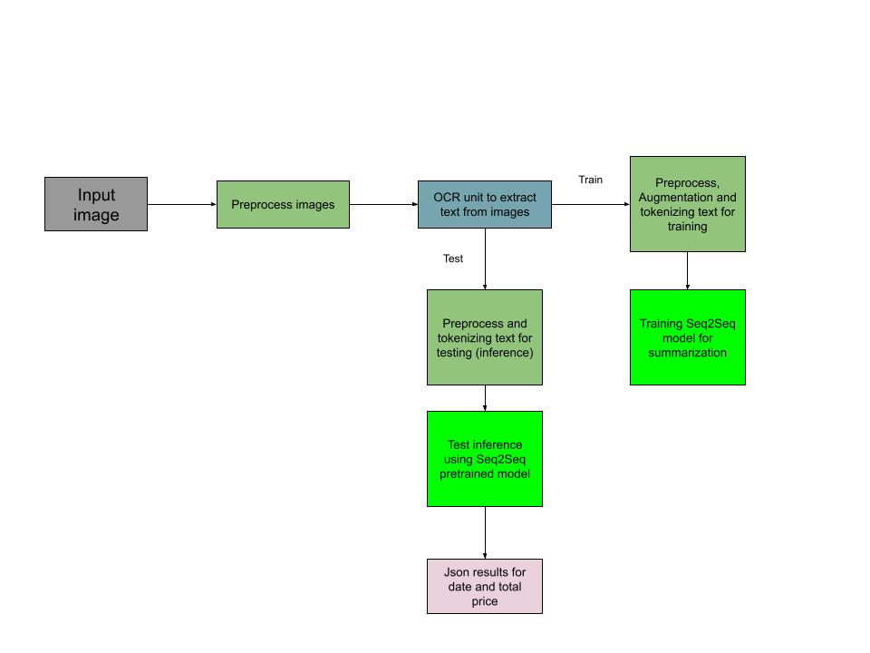
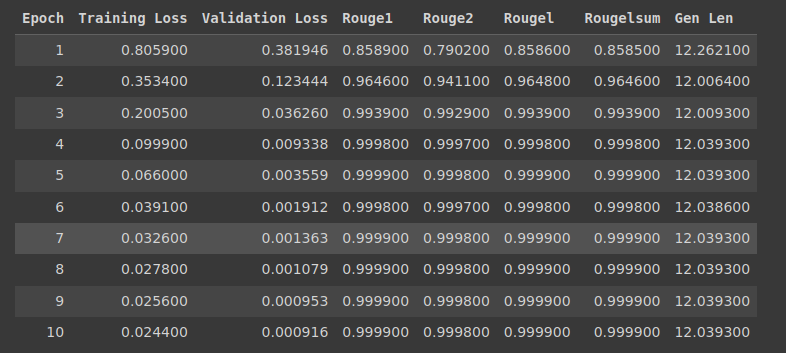

# OCRTransformer

A Python package to extract key information from images of the purchase receipts using OCR and Transformers.
This package is created to extract texts from some purchase receipts and detect key informations such as __date__ and __total__ price value. For this purpose, I have used __`pytesseract`__ to extract texts from images at the first stage. At the second stage, this extracted text whould pass through a __Seq2Seq__ model that learns the mapping between the input text and its __summarized key informations__ (label). I have used a [__Summarization__](https://huggingface.co/docs/transformers/tasks/summarization) architecture for thisk task, which could learn a mapping function from a __Disordered text__ to a __Summary of Information that is inside the disordered text__. I used 80% of images for training and 20% of them for final validation. Model does not see the validation data during training process.
You can find train and test data in __`OCRTransformer/dataset`__.


Overal architecture of this model is illustrated in the folling picture:

### Model architecture





## Get started


### __install__

1. This package is written based on __`tesseract`__,  so you should install required packages for it using the following commands:

    ```terminal
    sudo apt install tesseract-ocr
    sudo apt install libtesseract-dev
    ```


2. Clone the repository:

    ```terminal
    git clone https://github.com/hassan-teymoury/OCRTransformer.git
    ```

3. Go through the `OCRTransformer` directory:
    
    ```terminal
    cd OCRTransformer
    ```

4. Install the package:

    ```terminal
    pip install .
    ```


### Inference

After `ocrtransform` package has been installed, you can get inference for your test data using the following command:

```terminal
python tools/demo.py --img_path=dataset/test_data/01.jpg
```

Or you can just use the following __Python__ script:

```python
from ocrtransform.model import detector

det = detector.Detector()
txt_res = det.forward_model(img_path="/content/OCRTransformer/dataset/test_data/02.jpg")
json_res = det.postprocess()

print(json_res)
```

Output:
```terinal
{'date': '24/12/2019', 'total': '590.00'}
```

## Train

Before starting to train the data, I have augmneted the small set of data for better learning. Because there was no spedific pattern in the texts that were extracted from OCR, I splitted the words in each text and randomly arranged them in the different texts with same labels. 

This model has been trained with a __`t5-small`__ pretrained model for 10 epochs and batch size of 16 in __Colab__.  __Note that here I splitted the training data (80% of images that were seperated at the beggining) to train and test again for Seq2Seq model.  So we have train, test and validation sets now__.

You can download the [__pretrained model__](https://drive.google.com/drive/folders/16R6xaxp_N5fYfXfaC96JOFxgtcsNGdxY?usp=sharing) also and run the inference and train processes in a customized approach


Training results showed that the model is converging during the train process:



### Training inference on your own data

To train the model on your own data, you can run the following command with your specific arguments:

```terminal
python tools/demo_train.py --batch_size=4 --epochs=1 --imgs_path=dataset/images --anno_path=dataset/key_information/key_information.json --augment=True --out_dir=summarize_model
```

Or you can use the python script as shown bellow:

#### Python script
```python
from ocrtransform.model import trainer

imgs_path = "/content/OCRTransformer/dataset/images"
labels_path = "/content/OCRTransformer/dataset/key_information/key_information.json"
batch_size = 4
epochs = 1
augment = True
out_dir = "myawesome_detector"

trainer_obj = trainer.Trainer(
    imgs_path=imgs_path, anno_path=labels_path, augment=augment,
    epochs=epochs, batch_size=batch_size, output_dir=out_dir
)

trainer_obj.train()
```
